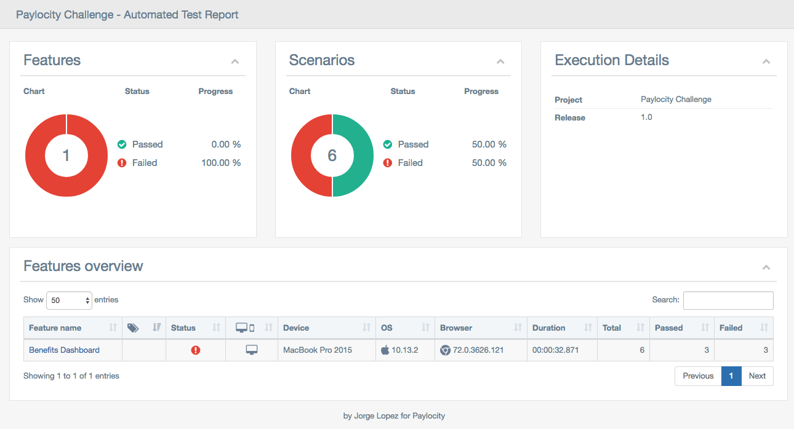
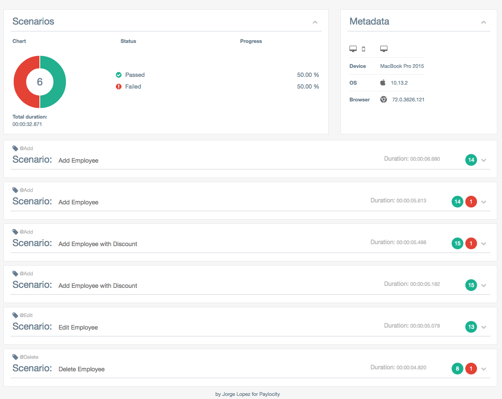
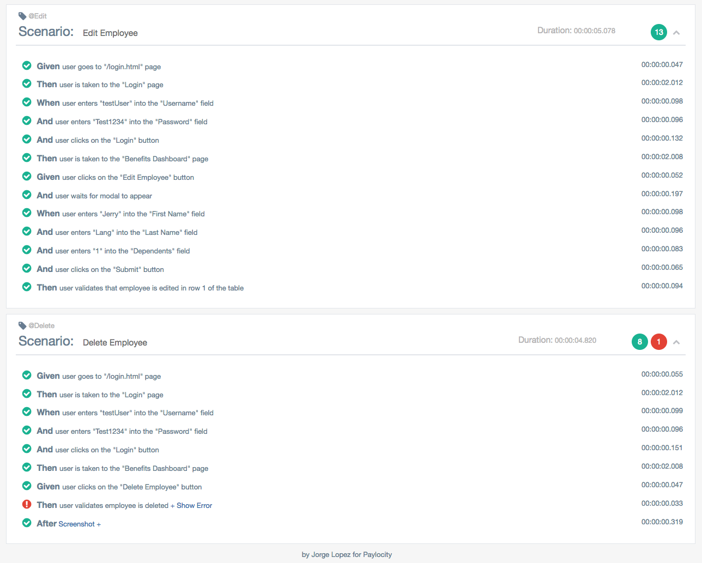

# Paylocity Challenge`(paylocity-challenge)`
*Created by Jorge Lopez*

### Table of contents
1. [Install app dependencies](#installation)
2. [Set up environment variables](#setting-environment-variables)
3. [Run the test](#running-the-tests)
4. [Defects](#defects)

## Installation
All the dependencies are managed by npm.
to install all required modules listed in the ./package.json file, run the following command: `npm install`
The Paylocity Benefits Dashboard page will be then installed as it is contained in the following repository:
https://github.com/borbe/paylocity-challenge-resources
This will enable the page to work on a local environment without having to grab the files from other sources.


## Setting environment variables:
All the test scripts provided in this suite are dependent on the environment variables set in the `./env/test.env`.
All the instructions and details related to each of the variables needed in the configuration can be found in such file.

The value for each of these environment variables must be manually entered before executing the tests.
Test Execution Config is managed by the file: `protractor-grid.conf.js`.
(this file is located in https://github.com/borbe/paylocity-test-fwk, ./node_modules/paylocity-test-fwk/)
This repository contains the core framework and configuration as well as generic reusable action step definitions.

By default, if you do not include `BROWSER`, the framework will use chrome as the default browser.

In order to run the test using your environment file, you need to specify it when you run the test (see below). The actual configuration is set inside `Gruntfile.js`.
```javascript
  dotenv.config({ path: `./env/${process.env.NODE_ENV}.env` });
```

## Running the tests
To run the tests with Grunt, simply run the command: `NODE_ENV=test grunt` or `. ./env/test.env && grunt`.

The project is configured with Grunt to automatically update the WebDriver (`webdriver-manager update`) whenever the tests are ran.
                                                               
After the tests are completed the Cucumber BDD report [protractor-multiple-cucumber-html-reporter-plugin](https://www.npmjs.com/package/protractor-multiple-cucumber-html-reporter-plugin) will be generated and automatically shown in the browser, it will also be stored in `reports/` folder.

## Sample Cucumber BDD Report:




## Defects
Defects found as result of testing "Paylocity's Challenge Benefits Dashboard" can be found in the following document:
[DEFECTS.md](resources/defects/DEFECTS.md)