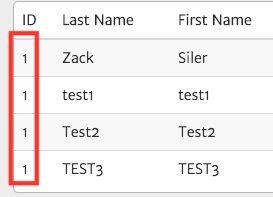
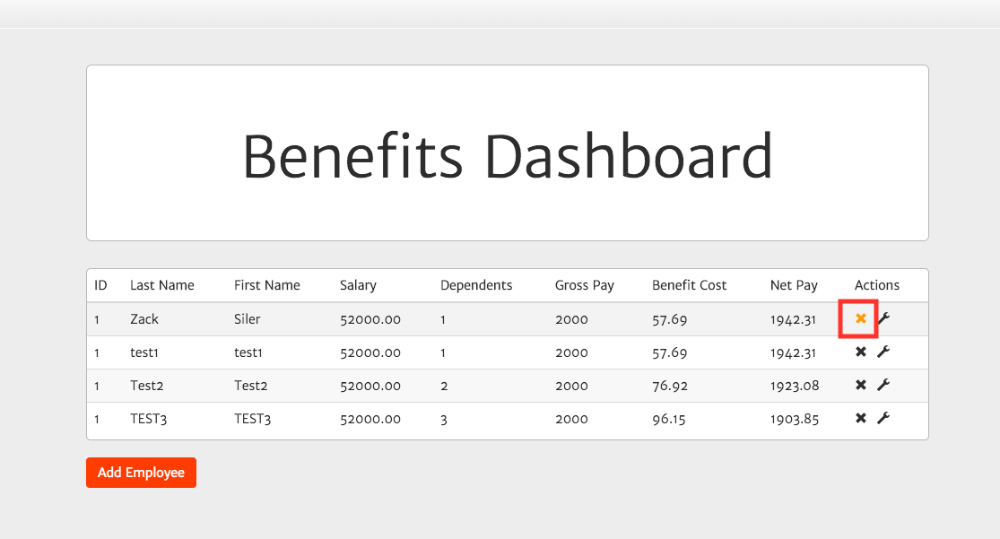
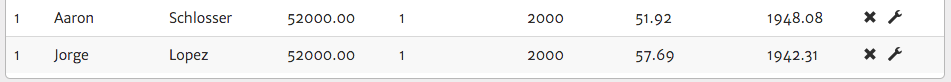
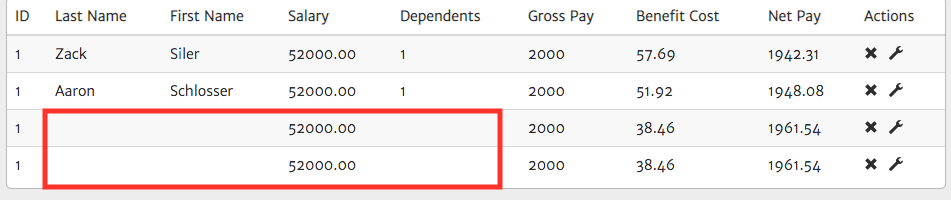
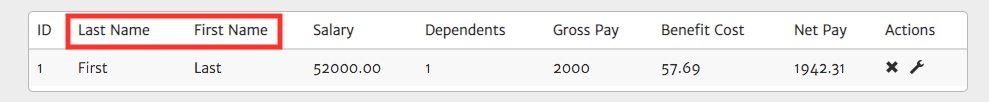
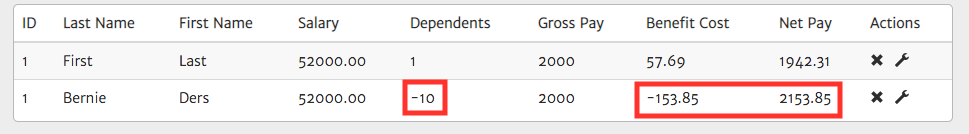
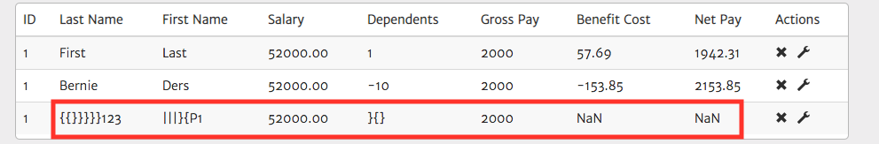
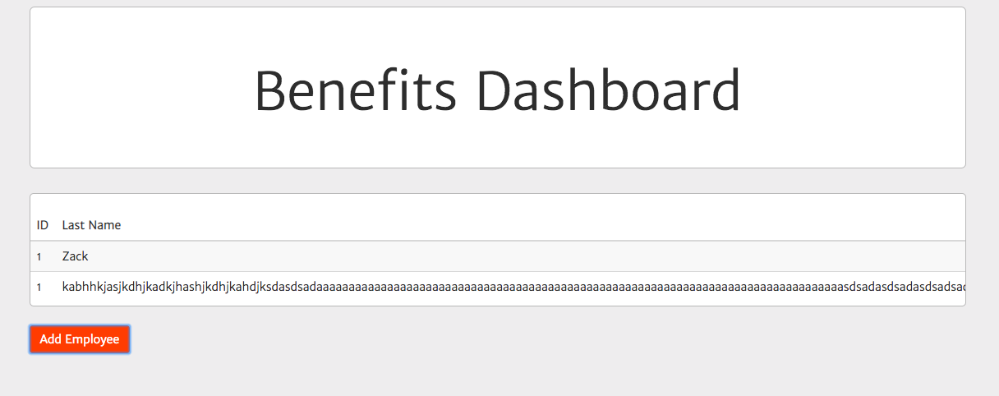

# Defects
* * *
The following defects were found while testing the Paylocity Challenge "Benefits Dashboard".
* * *

##### ID:001
##### Summary: Employee ID is always set to "1".
##### Description: Employee ID in Benefits Dashboard - Employee table is always set to "1".
##### Severity: High

##### Preconditions: Log in using valid credentials.
##### Test Data: Username: testUser, Password: Test1234

###### Steps to reproduce:
1. Log in using the test data provided.
2. On the "Benefits Dashboard" page, click the "Add Employee" button
3. Input any Employee First Name, Last Name & Dependent information.
4. Click the "Submit" button
5. Repeat steps 2,3,4. 

###### Actual Result:
All employees have "1" as ID in the Table.

###### Expected Result:
Each submission should generate an unique ID for the new employees.

###### Screenshot:

##### ID:002
##### Summary: Delete Button does not work.
##### Description: Delete button in the Benefits Dashboard - Employee table does not work.
##### Severity: High

##### Preconditions: Log in using valid credentials.
##### Test Data: Username: testUser, Password: Test1234

###### Steps to reproduce:
1. Log in using the test data provided.
2. On the "Benefits Dashboard" page, click the "X" button on any employee row.

###### Actual Result:
Employee remains in the table after trying to delete.

###### Expected Result:
Employee should be deleted from the table.

###### Screenshot:

##### ID:003
##### Summary: Employees that start with A as First Name are always given 10% discount.
##### Description: Employees that start with A as First Name are always given 10% discount in their benefits.
##### Severity: High

##### Preconditions: Log in using valid credentials.
##### Test Data: Username: testUser, Password: Test1234

###### Steps to reproduce:
1. Log in using the test data provided.
2. On the "Benefits Dashboard" page, click the "Add Employee" button
3. Input any Employee First Name that starts with "A", Last Name & Dependent information.
4. Click the "Submit" button

###### Actual Result:
Employees which name starts with "A" are given a 10% benefit discount.

###### Expected Result:
All Employees should have the same costs for benefits.

###### Screenshot:

##### ID:004
##### Summary: Blank data employees can be added. 
##### Description: Employees with blank data can be inserted in the Benefits dashboard.
##### Severity: High

##### Preconditions: Log in using valid credentials.
##### Test Data: Username: testUser, Password: Test1234

###### Steps to reproduce:
1. Log in using the test data provided.
2. On the "Benefits Dashboard" page, click the "Add Employee" button
3. Leave the Add Employee modal blank.
4. Click the "Submit" button

###### Actual Result:
Blank Employee is added.

###### Expected Result:
Submission of empty inputs should be prevented in the Add Employee form.

###### Screenshot:

##### ID:005
##### Summary: Employee First Name and Last Name labels are incorrect.
##### Description: Employee First Name and Last Name labels are located in the wrong position in the employee table.
##### Severity: High

##### Preconditions: Log in using valid credentials.
##### Test Data: Username: testUser, Password: Test1234

###### Steps to reproduce:
1. Log in using the test data provided.
2. On the "Benefits Dashboard" page, click the "Add Employee" button
3. Enter "First" in the "First Name" field
4. Enter "Last" in the "Last Name" field
5. Click the "Submit" button

###### Actual Result:
Last Name & First Name label in the table columns are misplaced. 

###### Expected Result:
First Name label should be swapped with Last Name label.

###### Screenshot:

##### ID:006
##### Summary: Employee can be added using negative values for dependents.
##### Description: Employee can be added using negative values for dependents resulting in negative benefit cost.
##### Severity: High

##### Preconditions: Log in using valid credentials.
##### Test Data: Username: testUser, Password: Test1234

###### Steps to reproduce:
1. Log in using the test data provided.
2. On the "Benefits Dashboard" page, click the "Add Employee" button
3. Input any Employee First Name, Last Name.
4. Input "-10" for Dependents.
5. Click the "Submit" button 

###### Actual Result:
Employees can be added with negative Dependent values, Employee Benefit Cost is negative as result.

###### Expected Result:
Add Employee form should validate negative values for dependents and not allow submission.

###### Screenshot:

##### ID:007
##### Summary: Special characters are allowed when adding new employees.
##### Description: Special characters are allowed for First Name, Last Name & Dependents when adding new employees.
##### Severity: High

##### Preconditions: Log in using valid credentials.
##### Test Data: Username: testUser, Password: Test1234

###### Steps to reproduce:
1. Log in using the test data provided.
2. On the "Benefits Dashboard" page, click the "Add Employee" button
3. Enter special characters in the "First Name" field
4. Enter special characters in the "Last Name" field
5. Enter special characters in the "Dependents" field
6. Click the "Submit" button

###### Actual Result:
Special characters are allowed to be submitted in the add employee form, resulting in invalid data and "NaN" Benefit Cost.

###### Expected Result:
Special characters should not be allowed to be submitted in the add employee form.

###### Screenshot:

##### ID:008
##### Summary: No string length limit for Add Employee values when adding employee.
##### Description: No string length limit for Add Employee values when adding employee, resulting in table improperly displayed.
##### Severity: Medium

##### Preconditions: Log in using valid credentials.
##### Test Data: Username: testUser, Password: Test1234

###### Steps to reproduce:
1. Log in using the test data provided.
2. On the "Benefits Dashboard" page, click the "Add Employee" button
3. Enter more than 100 characters in the "First Name" field
4. Enter more than 60 characters in the "Last Name" field
5. Enter more than 60 characters "Dependents" field
6. Click the "Submit" button

###### Actual Result:
No validation for string length limit occurs for Add Employee values, resulting in the table resizing wrong.

###### Expected Result:
Add employee form should not allow long strings.

###### Screenshot:

##### ID:009
##### Summary: Employees are deleted when refreshing the page.
##### Description: All employees are deleted when refreshing the page.
##### Severity: High

##### Preconditions: Log in using valid credentials.
##### Test Data: Username: testUser, Password: Test1234

###### Steps to reproduce:
1. Log in using the test data provided.
2. On the "Benefits Dashboard" page, click the "Add Employee" button
3. Input any Employee First Name, Last Name & Dependent information.
4. Click the "Submit" button
5. Refresh the browser page.

###### Actual Result:
All employees should persist in the table.

###### Expected Result:
All employees are deleted from the table.